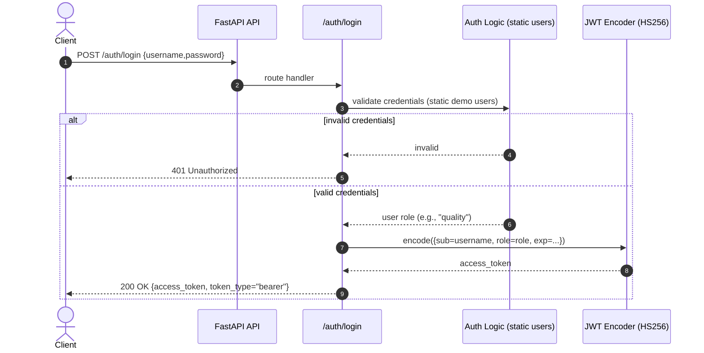
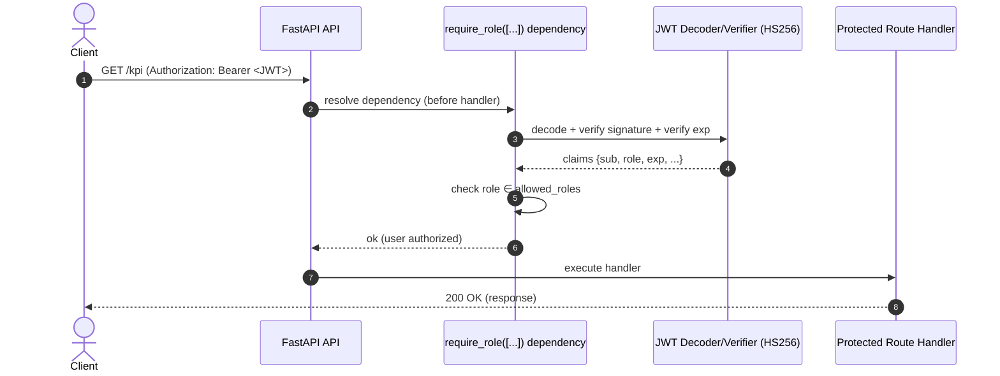
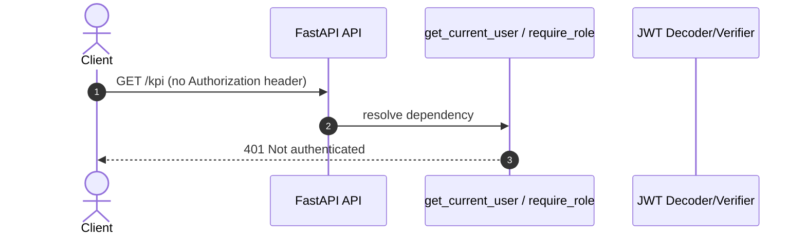
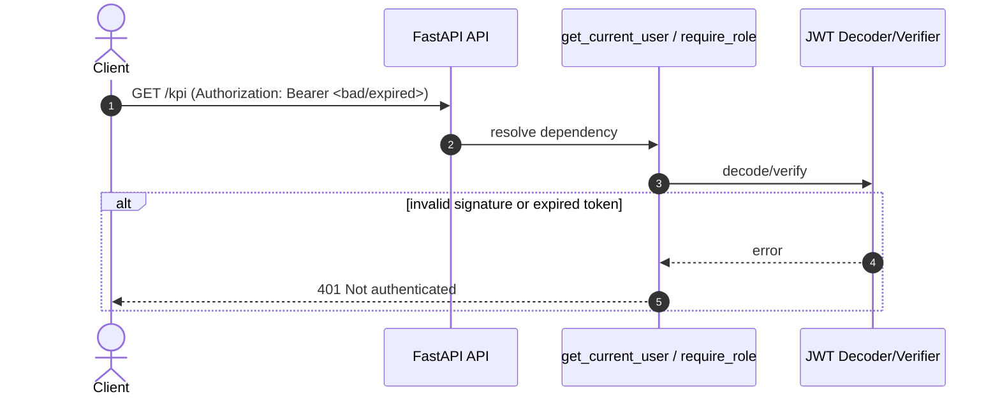
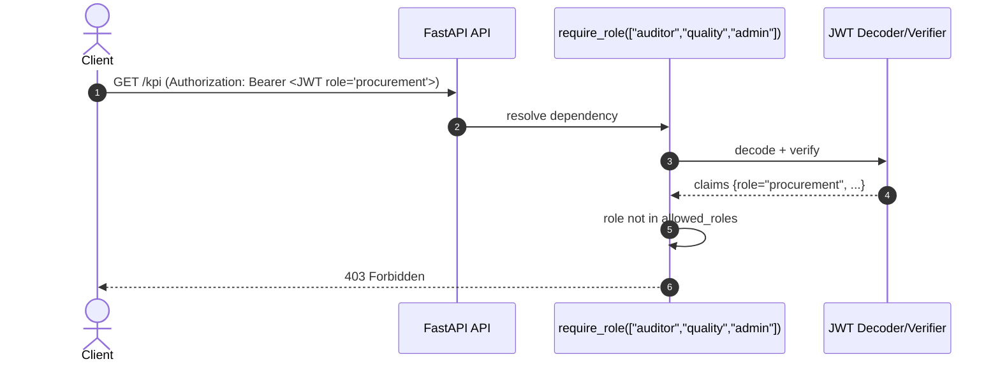

# Sequence Diagram — JWT + RBAC Enforcement

This sequence describes how authentication and authorization (RBAC) work in the API:
- `/auth/login` returns a JWT containing a `role` claim.
- Protected endpoints enforce access via a FastAPI dependency (`require_role([...])`).

---

## 1) Login → JWT with role claim

### Notes

* The issued token embeds the **role claim** (e.g., `"role": "quality"`).
* Token expiry is handled via `exp`.

---

## 2) Protected endpoint → dependency RBAC check (happy path)

### Notes

* Authorization happens **before** the route handler runs.
* Services don’t re-check auth: the API boundary is the enforcement point.

---

## 3) Missing/invalid token → 401 Not authenticated

---

## 4) Valid token but wrong role → 403 Forbidden

---

## 5) Policy mapping lives at the endpoint (RBAC “at a glance”)

RBAC is expressed directly on endpoints via:
* `dependencies=[Depends(require_role([...]))]`

This makes authorization:
- explicit
- audit-friendly
- easy to review in code reviews
