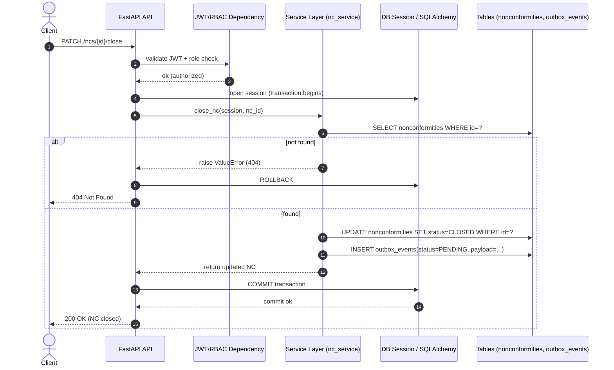

# Sequence Diagram — Transaction Boundary & Outbox Processing

This sequence describes how a domain write (e.g., creating a Non-Conformity) is persisted together with an outbox event in a single DB transaction, and how the background worker processes the event in an idempotent way.

---

## 1) Create Non-Conformity (Domain write + Outbox write, single transaction)

```mermaid
sequenceDiagram
    autonumber
    actor Client
    participant API as FastAPI API
    participant Auth as JWT/RBAC Dependency
    participant Svc as Service Layer (nc_service)
    participant DB as DB Session / SQLAlchemy
    participant T as Tables (nonconformities, outbox_events)

    Client->>API: POST /ncs {supplier_id, severity, description}
    API->>Auth: validate JWT + role check
    Auth-->>API: ok (authorized)

    API->>DB: open session (transaction begins)
    API->>Svc: create_nc(session, ...)
    Svc->>T: INSERT nonconformities(...)
    Svc->>T: INSERT outbox_events(status=PENDING, payload=...)
    Svc-->>API: return created NC

    API->>DB: COMMIT transaction
    DB-->>API: commit ok
    API-->>Client: 201 Created (NC)
````

### Notes

* The **domain state change** (NonConformity) and the **event emission** (OutboxEvent) are atomic.
* If anything fails before commit, **both inserts are rolled back**.

---

## 2) Worker Polling & Idempotent Event Processing

```mermaid
sequenceDiagram
    autonumber
    participant Worker as Worker (poll loop)
    participant DB as DB Session / SQLAlchemy
    participant Outbox as outbox_events
    participant Dedup as processed_events
    participant Audit as audit_log

    loop Poll every interval
        Worker->>DB: open session
        Worker->>Outbox: SELECT id FROM outbox_events WHERE status=PENDING ORDER BY id LIMIT N
        Outbox-->>Worker: [event_id...]
        alt no events
            Worker-->>DB: COMMIT (no-op) + close
        else events present
            loop for each event_id
                Worker->>Dedup: SELECT 1 FROM processed_events WHERE event_id=?
                alt already processed
                    Dedup-->>Worker: hit
                    Worker->>Outbox: UPDATE outbox_events SET status=PROCESSED WHERE id=? (optional)
                else not processed
                    Dedup-->>Worker: miss
                    Worker->>Audit: INSERT audit_log(actor, action, entity_type, entity_id, meta_json)
                    Worker->>Dedup: INSERT processed_events(event_id, processed_at)
                    Worker->>Outbox: UPDATE outbox_events SET status=PROCESSED WHERE id=?
                end
            end
            Worker-->>DB: COMMIT + close
        end
    end
```

### Notes

* The worker provides **at-least-once processing** with an **idempotent consumer**.
* `processed_events` prevents duplicate side effects after restarts/crashes.
* Failure handling can mark events as `FAILED` depending on policy.

---

## 3) Failure Cases (What the sequence guarantees)

### A) API fails before commit

* No `nonconformities` row
* No `outbox_events` row
* Client receives error
* System remains consistent

### B) API commits, worker crashes before processing

* Domain row exists
* Outbox row exists in `PENDING`
* Worker restarts and processes later (no loss)

### C) Worker processes, crashes before marking processed

* Outbox may remain `PENDING`
* On restart, the same event is fetched again
* `processed_events` ensures idempotent behavior (no duplicate audit writes)

---

## 4) Close Non-Conformity (state transition + outbox, single transaction)

This sequence describes a state transition (OPEN → CLOSED) and event emission within the same transaction.



### Notes

* State transition and outbox emission remain atomic.
* A missing NC triggers rollback and returns 404.
* Any exception before commit guarantees no outbox artifact is written.

---

## 5) Transaction Ownership (Who controls commit/rollback)

This project intentionally centralizes transaction ownership at the boundary:

* **Routes own the transaction scope** via `with get_session() as session:`
* **Services are transaction-aware** (they require a session), but do not commit.
* **Commit happens exactly once** at the end of the route scope (if no exception).
* **Rollback happens automatically** on any exception.

### Why this matters

* Clear auditability of transaction boundaries
* Prevents hidden commits inside business logic
* Makes failure behavior deterministic
* Enables reliable outbox patterns

### Anti-patterns intentionally avoided

* Committing inside service functions
* Multiple commits per request
* Mixing auth logic into services
* Executing side effects inside the request transaction (instead of outbox)

---

## 6) Optional: Worker as “one-shot” vs “long-running”

The worker in this demo runs as a long-running polling loop.

However, the processing logic is structured to be reusable as a one-shot job:

* `run_once()` performs a bounded fetch-and-process cycle
* A long-running loop simply calls `run_once()` repeatedly with sleep

This allows easy future evolution into:

* cron-style scheduled job
* systemd service
* containerized worker deployment
* message-queue consumer (replace polling strategy)
